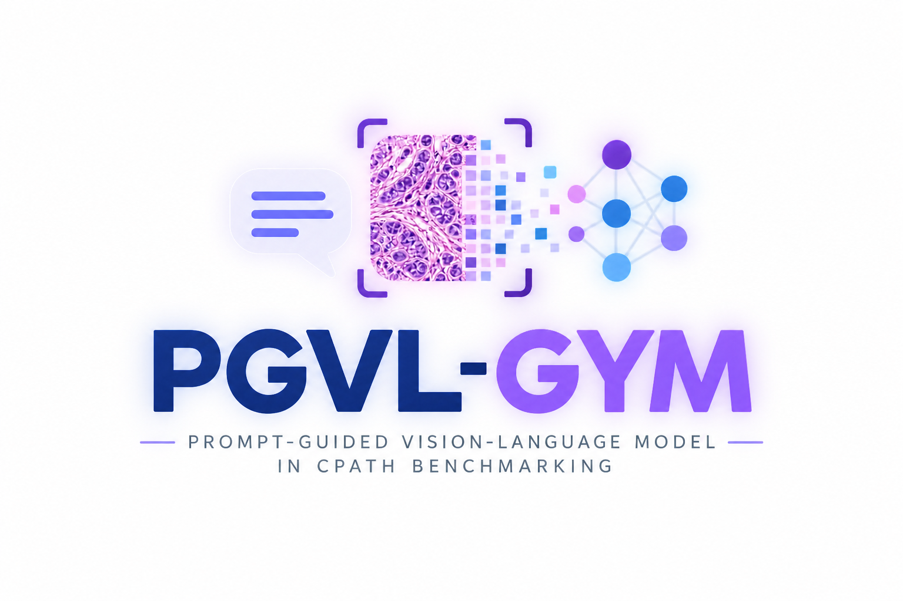

---
hide:
  - toc
---

<section class="pgvl-hero" aria-labelledby="pgvl-title">
  

    <h1 id="pgvl-title">PGVL-Gym</h1>
    

      A configuration-first framework for systematic, reproducible evaluation
      of whole-slide pathology vision-language models.
    

    

      <a class="md-button pgvl-button pgvl-button--primary" href="getting-started/">Run your first benchmark →</a>
      <a class="md-button pgvl-button pgvl-button--primary" href="architecture/">Explore the architecture</a>
    

  

  <figure class="pgvl-hero__visual">
    
  </figure>
</section>

  
<strong>20</strong>experiment variants

  
<strong>13+</strong>model families

  
<strong>5</strong>cohort protocols

  
<strong>∞</strong>feature backbones

## The benchmark contract

PGVL-Gym turns every experiment into the same explicit contract: a method
adapter, a dataset protocol, and traceable feature provenance. The result is a
comparison you can explain, reproduce, and extend.

  <article class="pgvl-card">
    01
    <h3>Configure the task</h3>
    
Labels, prompts, folds, shots, resolutions, and paths stay in readable protocol files—not hidden in training code.

    <a href="configuration/">Configuration guide →</a>
  </article>
  <article class="pgvl-card">
    02
    <h3>Declare provenance</h3>
    
Every cached tensor records its encoder, feature space, level, and resolution so incompatible assets fail early.

    <a href="architecture/">Feature architecture →</a>
  </article>
  <article class="pgvl-card">
    03
    <h3>Compare fairly</h3>
    
Shared seeds, patient-disjoint folds, identical shot counts, and aligned reporting keep the scoreboard honest.

    <a href="benchmarks/">Benchmark protocols →</a>
  </article>

## From feature store to fair result

  
01<strong>Features</strong><small>patch or slide level</small>

  
→

  
02<strong>Protocol</strong><small>task, fold, shots</small>

  
→

  
03<strong>Adapter</strong><small>declared capability</small>

  
→

  
04<strong>Report</strong><small>comparable metrics</small>

FOCUS, MAPLE, MSCPT, MUSE, PathPT, ViLa-MIL, CoD-MIL, TOP, SLIP, WSI-FiVE,
ConVLM, SLDPC, and composite variants all enter through the same registry. The
generated protocols currently cover TCGA-NSCLC, TCGA-BRCA, TCGA-RCC,
CAMELYON16, and UBC-OCEAN.

!!! note "Model fidelity is part of fairness"

    The shared interface standardizes loading, validation, and orchestration.
    It never silently redesigns a paper architecture. Fixed and allowlisted
    encoder boundaries remain explicit—even when another encoder has the same
    output dimension.

  

    <h2>Start with a validated configuration.</h2>
    
Build a smoke-tested run before committing expensive GPU hours.

  

  <a class="md-button pgvl-button pgvl-button--primary" href="getting-started/">Get started →</a>

